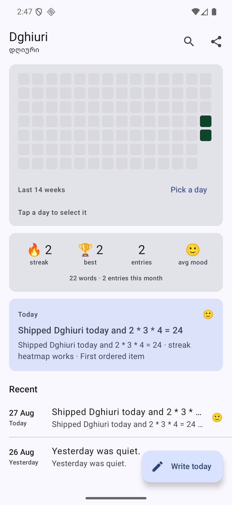
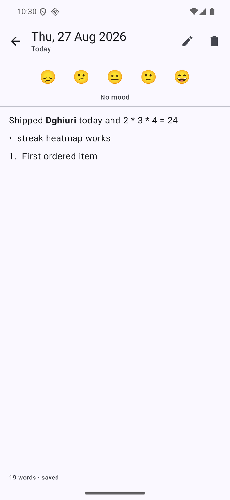
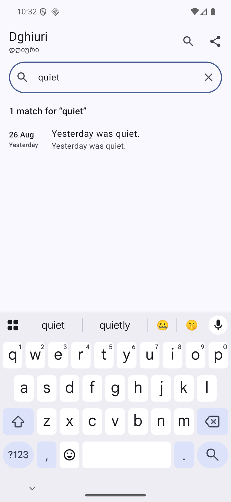

# Dghiuri 📓

[](https://github.com/Meko123456/Dghiuri/actions/workflows/ci.yml)
[](https://github.com/Meko123456/Dghiuri/releases)
[](LICENSE)

**დღიური** (*dghiuri* — Georgian for "diary") — a private, on-device **daily journal**
for Android: one markdown entry per day, a mood score, and a **year heatmap** of your
journaling streak.

No accounts, no cloud, no analytics. Your words stay on your phone.

## Why this app exists

Dghiuri is the first real consumer of **both** of my published Kotlin libraries:

| Library | Used for |
|---|---|
| [`io.github.meko123456:markdown-blocks`](https://github.com/Meko123456/markdown-blocks) | parsing each entry into blocks/spans, rendered natively with Compose |
| [`io.github.meko123456:heatmap`](https://github.com/Meko123456/heatmap-compose) | the GitHub-style streak heatmap on the home screen |

Publishing a library is one thing; dogfooding it across apps is what proves the API
holds up. Dghiuri is that proof.

## Screenshots

| Home | Rendered entry | Search |
|:---:|:---:|:---:|
|  |  |  |

## Features

- 📝 **One entry per day** — a monospace markdown editor with an edit/preview toggle. Preview
  renders headings, bullet and ordered lists, quotes, fenced code, dividers, bold/italic/code,
  strikethrough and tappable links — natively in Compose, from the `markdown-blocks` tree.
  Autosave is debounced (600 ms) and flushed on Back, so nothing you typed is lost.
- 🙂 **Mood score** — a 1–5 emoji mood per entry, shown on each row and averaged in stats.
- 🟩 **Streak heatmap** — GitHub-style grid of your writing (the `heatmap` library), shaded by
  entry length on a fixed 1–4 scale. Columns adapt to the screen width; tap a day to select it,
  then *Open* — or use *Pick a day* (a date picker, also the screen-reader route to past days).
- 🔥 **Streaks & stats** — current streak (alive until midnight passes), longest streak, total
  entries, average mood, words written, entries this month.
- 🔍 **Search** across all entries — literal matching (`%`/`_` aren't wildcards), debounced.
- 📤 **Export** the whole diary as one markdown document via the system file picker.
- 🌙 **Midnight-safe** — "today" rolls over at local midnight and on returning to the app, so
  a late-night session never writes into yesterday.
- 🔒 **Private by design** — Room database on-device; the app declares **no network permission**.
- ♿ **Accessible** — every control has an action label, the mood picker exposes selection
  state, the heatmap reports "N of the last M days written".
- 🎨 **Material 3** — dynamic color, light/dark, edge-to-edge.

## Architecture

Single-module Compose app on the shared toolchain (Gradle 9.3 / AGP 9.1 / Compose BOM 2026.06):

```
data/     Room: Entry(epochDay PK, markdown, mood, updatedAt) + DAO + repository
domain/   pure Kotlin, 81 unit tests — StreakEngine (streaks, heatmap intensity),
          HeatmapGeometry (tap → day, mirrors the library's Canvas layout), EntryPreview
          (title/snippet from parsed blocks), EntryStats, MarkdownExport, DayClock, Mood
ui/       Compose — Home (heatmap card, stats, today card, recent list, search, export),
          Editor (edit/preview toggle, mood picker, debounced autosave),
          MarkdownText renderer over the markdown-blocks tree
```

Pure logic never touches Android: streaks, geometry, previews, export and the day clock are
plain Kotlin objects tested with JUnit. The heatmap library draws on a single Canvas, so
`HeatmapGeometry` reproduces its layout math to turn a tap offset back into an epoch day.

### Library dependency note

`heatmap` is consumed straight from Maven Central. `markdown-blocks` is declared by its
Maven coordinates too, but until its `v0.1.0` release lands on Central the build
substitutes a **Gradle composite build** of the sibling checkout (`../markdown-blocks`),
which CI clones alongside. Removing that substitution is tracked as an issue.

## Build & run

```sh
git clone https://github.com/Meko123456/Dghiuri.git
git clone https://github.com/Meko123456/markdown-blocks.git   # sibling, until published
cd Dghiuri && ./gradlew :app:installDebug
```

## Status

**v0.1.0** — feature-complete for daily use; see the [issues](https://github.com/Meko123456/Dghiuri/issues)
for what's next (swapping the composite build for the published `markdown-blocks` artifact once
it lands on Maven Central).

## License

[MIT](LICENSE)
